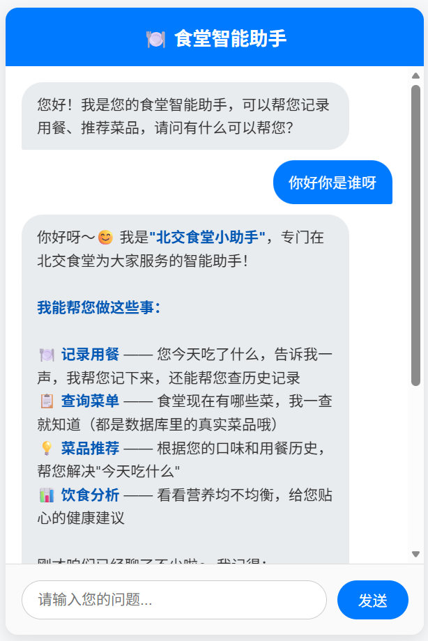
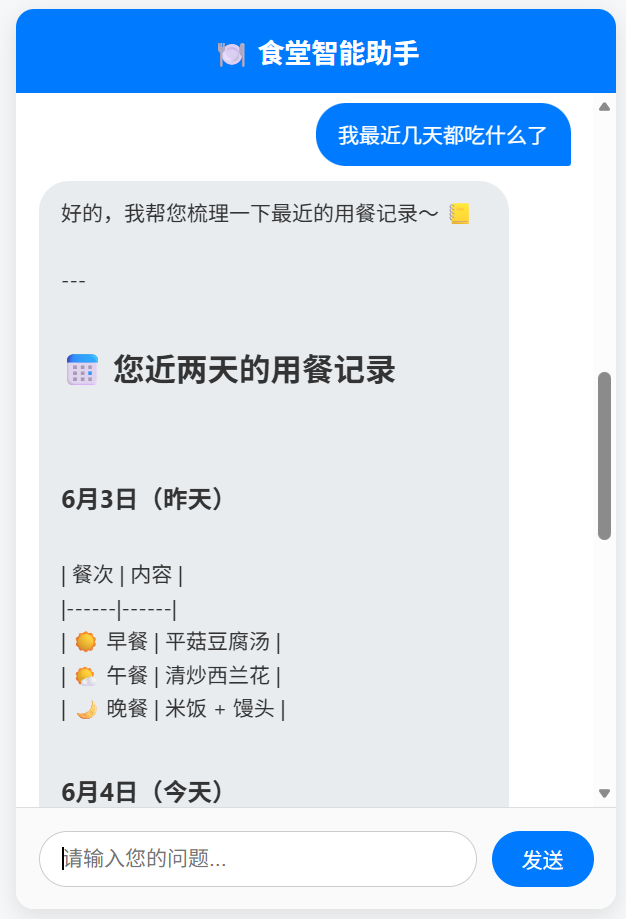
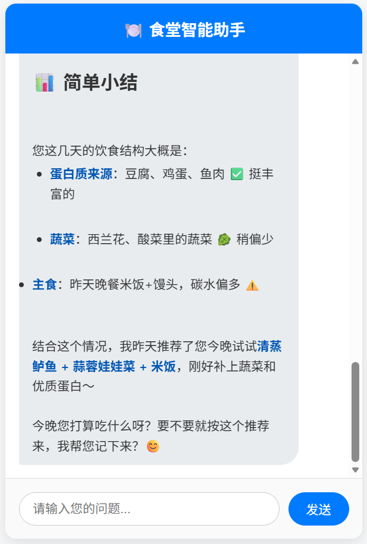

# 易校园 —— 校园美食采购平台

> 一个基于 SpringBoot 的校园美食采购平台，集成了智能 AI 助手，提供便捷的校园餐饮服务体验。

## 📖 项目简介

易校园是一个专为校园场景设计的智能美食采购平台，旨在为师生提供便捷的校园餐饮服务。项目不仅实现了基础的商户查询、菜品浏览和优惠券秒杀等电商核心功能，还创新性地集成了基于 Spring AI 的智能食堂助手 Agent，为用户提供个性化的菜品推荐和用餐记录服务。

## 🚀 技术栈

### 后端核心
- **SpringBoot** - 项目基础框架
- **MyBatis** - ORM 持久层框架
- **MySQL** - 关系型数据库
- **Redis** - 缓存、分布式锁、限流

### 中间件
- **Kafka** - 消息队列，异步处理秒杀订单
- **Nginx** - 反向代理与负载均衡
- **Lua** - Redis 脚本，原子性操作

### AI 能力
- **LangChain4j** - AI 服务集成框架
- **Markdown 渲染** - 前端富文本展示

## ✨ 核心功能

### 1. 🛡️ 登录模块
- 使用 Redis 共享 Session，支持多实例部署
- 多级拦截器自动刷新 Token，保障登录态安全
- 短信验证码登录校验，提升用户体验

### 2. 🎯 优惠券秒杀
- **异步订单处理**：用户下单后通过 Kafka 消息队列异步处理库存扣减和订单生成，大幅提升并发性能
- **全局唯一 ID**：基于 Redis 生成订单全局唯一 ID，避免 ID 冲突
- **乐观锁防超卖**：使用订单库存作为版本号，解决库存超卖问题
- **一人一单限制**：通过 `setnx` 实现分布式锁，使用 `UUID+线程ID` 作为锁值防止误删锁
- **Lua 脚本原子性**：结合 Lua 脚本保证多命令操作的原子性

### 3. 🚦 滑动窗口限流
- 基于 `Redis + AOP + 注解` 实现灵活限流
- 支持全局、IP、用户多维度限流策略
- 有效防止系统过载和刷券行为

### 4. 🤖 智能食堂助手 Agent
- 基于 LangChain4j 框架构建智能对话服务
- **AI 服务接口**：通过 `@AiService` 注解声明式定义 AI 服务
- **餐食记录**：帮助用户记录三餐饮食，建立个人饮食档案
- **智能推荐**：基于用户历史偏好和健康需求，从数据库菜品中智能推荐
- **流式对话**：支持 SSE (Server-Sent Events) 流式响应，提升交互体验
- **会话记忆**：通过 `@MemoryId` 维护多轮对话上下文
- **工具调用**：使用 `@Tool` 注解集成餐食记录、菜品查询、智能推荐等多种工具
- **系统提示词**：通过 `@SystemMessage` 配置专业食堂助手 Prompt

### 5. 🍽️ 菜品管理
- 商户入驻与菜品上架管理
- 菜品分类与搜索功能
- 菜品营养信息展示

## AI聊天助手演示
<table>
  <tr>
    <td align="center">
      
       
      <em>图1：智能客服初始对话</em>
    </td>
    <td align="center">
      
       
      <em>图2：餐食记录功能</em>
    </td>
    <td align="center">
      
       
      <em>图3：菜品推荐功能</em>
    </td>
  </tr>
</table>
